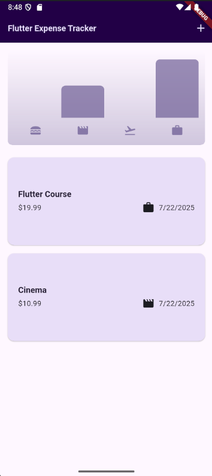
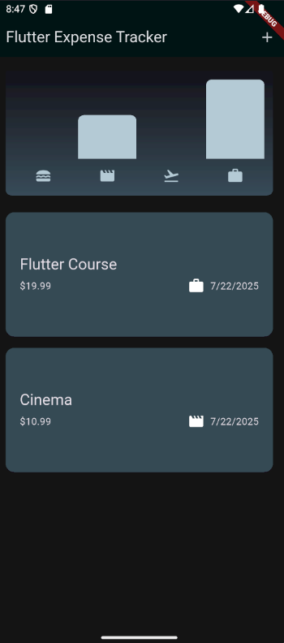
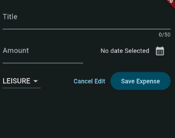
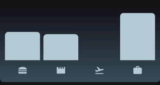

# 💰 Flutter Expense Tracker

A beautifully designed, responsive **expense tracking app** built with **Flutter**. Easily manage your daily spending, view analytics with clean charts, and enjoy a smooth experience across both light and dark modes.

---

## 📱 Features

- ✅ Add expenses with title, amount, date, and category
- 🗂️ Categories include: **Food**, **Travel**, **Leisure**, **Work**
- 📊 Real-time bar chart visualization
- 🌓 Automatic support for system light & dark theme
- 💻 Responsive layout (mobile + tablet)
- 🧽 Swipe to delete with **Undo** action

---

## 🎥 Demo

> Replace this GIF with a real screen recording of your app  
> 

---

## 🖼 Screenshots

| Home (Light) | Home (Dark) |
|--------------|-------------|
|  |  |

| New Expense Form | Chart |
|------------------|-------|
|  |  |

> 💡 You can add dark mode versions too, like `form_dark.png` and `chart_dark.png`

---

## 🧑‍💻 Tech Stack

- **Flutter** (Material 3)
- **Dart**
- [`intl`](https://pub.dev/packages/intl) — Date formatting
- [`uuid`](https://pub.dev/packages/uuid) — Unique expense IDs

---

## 📂 Folder Structure

lib/
├── main.dart # App entry point
├── models/
│ └── expense.dart # Expense model & category logic
├── widgets/
│ ├── chart/
│ │ ├── chart.dart # Chart widget
│ │ └── chart_bar.dart # Chart bar component
│ ├── expense_item.dart # Single expense card
│ ├── expenses_list.dart # Scrollable list of expenses
│ └── new_expense.dart # Modal for adding expenses
└── expenses.dart # Main home screen

---

## ⚙️ Getting Started

To run the app locally:

### 1. Clone the Repository

```bash
git clone https://github.com/yourusername/flutter_expense_tracker.git
cd flutter_expense_tracker

2. Install Dependencies
flutter pub get

3. Run the App
flutter run

🚀 App Overview
Modal Sheet: Add new expenses using a scrollable, responsive modal

SnackBar with Undo: Safely delete and restore expenses

Responsive Layout: Switches between column (mobile) and row (tablet)

Dynamic Chart Bars: Based on max category-wise spending

📸 Screenshot Placement
Place your screenshots inside a screenshots/ folder in the root directory:

screenshots/
├── home_light.png
├── home_dark.png
├── form_light.png
├── form_dark.png
├── chart_light.png
├── chart_dark.png
├── demo.gif

🧠 What I Learned
Building reusable widgets and clean architecture in Flutter

Using MediaQuery & LayoutBuilder for responsive design

Handling user input and validation

Theme customization for light and dark modes

🔮 Future Improvements
 Add local storage with shared_preferences or hive

 Add filters and sorting

 Export expenses to CSV

 Add app settings page

👤 Author
Made with ❤️ by Danish Nadeem
📧 danishnadeem16@gmail.com
🔗 LinkedIn • GitHub